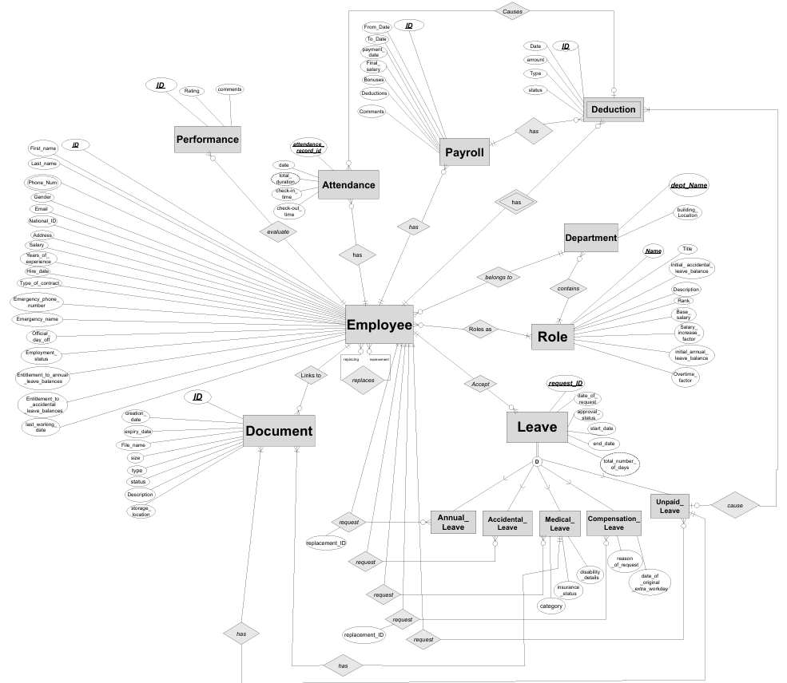
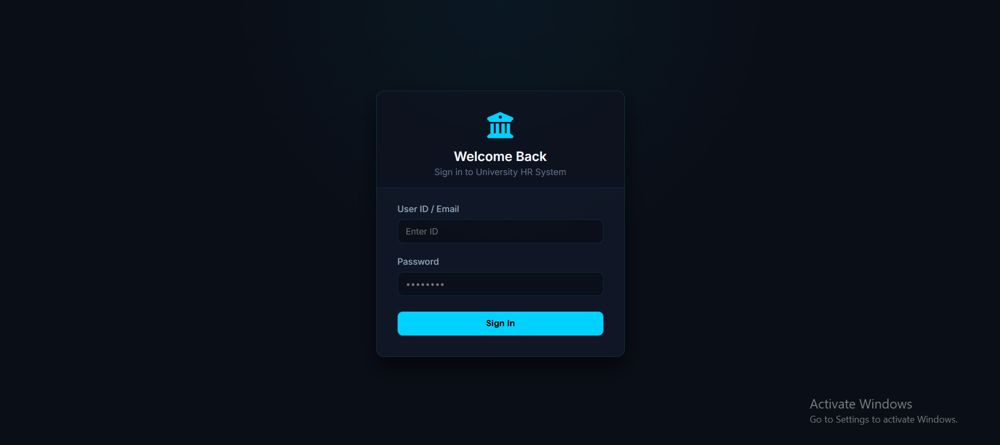
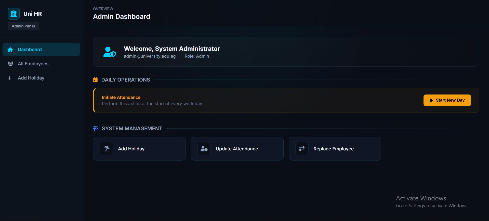
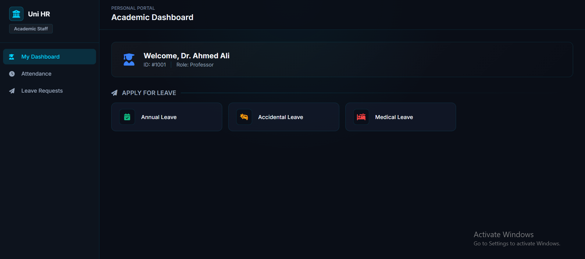

<div align="center">
  
  
  # University HR Management System 🎓💼

  A full-stack, enterprise-grade Human Resources management platform built for modern universities. It streamlines employee workflows, HR operations, payroll, attendance, and administrative management through a highly secure, role-based architecture.

  [](https://dotnet.microsoft.com/)
  [](https://learn.microsoft.com/en-us/aspnet/core/mvc/overview?view=aspnetcore-8.0)
  [](https://www.microsoft.com/en-us/sql-server)
  [](https://getbootstrap.com/)
</div>

---
## ✨ Key Features

- **Modern & Responsive UI**  
  Clean and simple interface that works well on all devices.

- **Role-Based Access**  
  Different dashboards and permissions for Admin, HR, Dean, and Employees.

- **Leave Management**  
  Employees can request leaves and managers can approve or reject them.

- **Attendance Tracking**  
  Track employee attendance and daily activity.

- **Payroll System**  
  Manage salaries, deductions, and monthly payments.

- **Reports & Statistics**  
  View basic insights about employees and departments.

---
## 🌐 Live Demo

You can try the system directly without installing anything:

🔗 **Live URL:**  
<https://uni-hr-system-bwcje8fjd4eme6b0.italynorth-01.azurewebsites.net>

> **Note:** Because this demo is hosted on a free Azure subdomain (`azurewebsites.net`) and includes a login page, some browsers (like Google Chrome) may incorrectly flag it as a "Deceptive site" or "Dangerous site". This is a standard false positive for new portfolio projects. You can safely click **Details** and then **Visit this unsafe site** to proceed.

### Test Accounts

Use the following accounts to explore different roles:

- **Admin**
  - Username: `admin`
  - Password: `admin123`

- **HR**
  - Username: `hr`
  - Password: `hr123`

- **Employee**
  - Username: `employee`
  - Password: `emp123`

- **Dean**
  - Username: `dean`
  - Password: `dean123`

---
## 🛠️ Tech Stack

*   **Backend:** C#, ASP.NET Core MVC (.NET 8)
*   **Database:** Microsoft SQL Server, Entity Framework Core (ADO.NET integrations)
*   **Frontend:** HTML5, Custom Modular CSS (Variables, Layout, Components), Bootstrap 5, FontAwesome
*   **Tools:** Visual Studio 2022, SQL Server Data Tools (SSDT)

---

## Prerequisites

- .NET 8 SDK
- Visual Studio 2022
- SQL Server


## 📂 Project Structure

```text
University-HR-Management-System/
├── src/
│   ├── UniversityHrManagementSystem.sln            # Main solution file
│   └── UniversityHrManagementSystem.Web/           # ASP.NET Core MVC project
│       ├── Controllers/                            # App logic & routing
│       ├── Views/                                  # Razor views (.cshtml)
│       └── wwwroot/                                # Static assets (CSS, JS)
├── database/
│   ├── UniversityHrManagementSystem.Database.sln   # SSDT project
│   └── UniversityHrManagementSystem.Database/      # Schema and seed data
└── docs/
    └── CONTRIBUTING.md                             # Contribution guidelines
```

---

## 🗄️ Database Schema (EERD)

The Enhanced Entity-Relationship Diagram (EERD) illustrates the normalized structure of the database, consisting of tables managing employees, departments, payrolls, and leaves.



---

## 📸 Screenshots

<!-- Replace the paths below with actual image paths once you take screenshots -->
- **Login Screen:** <br> 
- **Admin Dashboard:** <br> 
- **Employee View:** <br> 

---

## 🤝 Contributors

- **Mohamed Enan** - [LinkedIn Profile](https://www.linkedin.com/in/mohamed-enan1/)
- **Mahmoud Abohady** - [LinkedIn Profile](https://www.linkedin.com/in/mahmoud-abohady/)
- **Mohamed Shams** - [LinkedIn Profile](https://www.linkedin.com/in/mohamedshams01/)
- **Ziad Abdou** - [LinkedIn Profile](https://www.linkedin.com/in/ziad-abdou-a97ab8293/)
- **Youssef Maged** - [LinkedIn Profile](https://www.linkedin.com/in/youssef-maged-0563161b8/)
